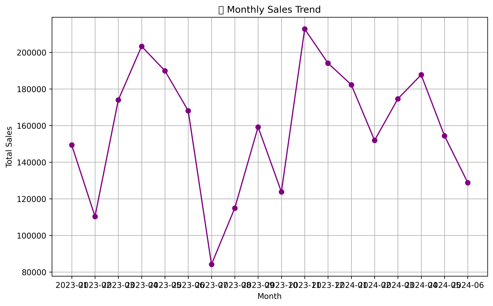

Sales Data Analysis

This project explores a fictional company’s sales data to extract key business insights using Python.

 Tools Used
- Python
- Pandas
- Matplotlib
- Seaborn
- Google Colab / Jupyter Notebook

Insights
- **Top Product:** Laptop
- **Best Sales Month:** March 2024
- **Top Sales Rep:** Sakura

Files
- `sales_data.csv` – Raw dataset
- `Sales_Data_Analysis.ipynb` – Main analysis notebook

Monthly Sales Trend
  

 Key Insights:
- The most revenue came from the **Laptop** category.
- **March 2024** had the highest sales overall.
- **Sakura** and **Haruto** were the top-performing sales reps.

 Conclusion:
The company should focus marketing efforts on laptops and consider giving bonuses to top reps.
